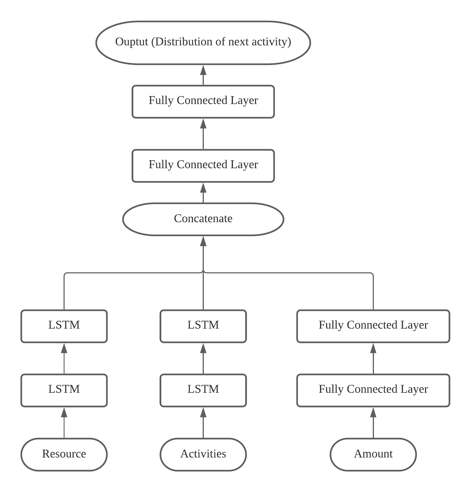
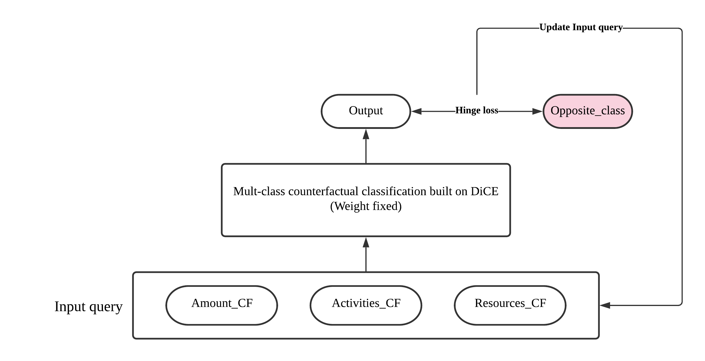
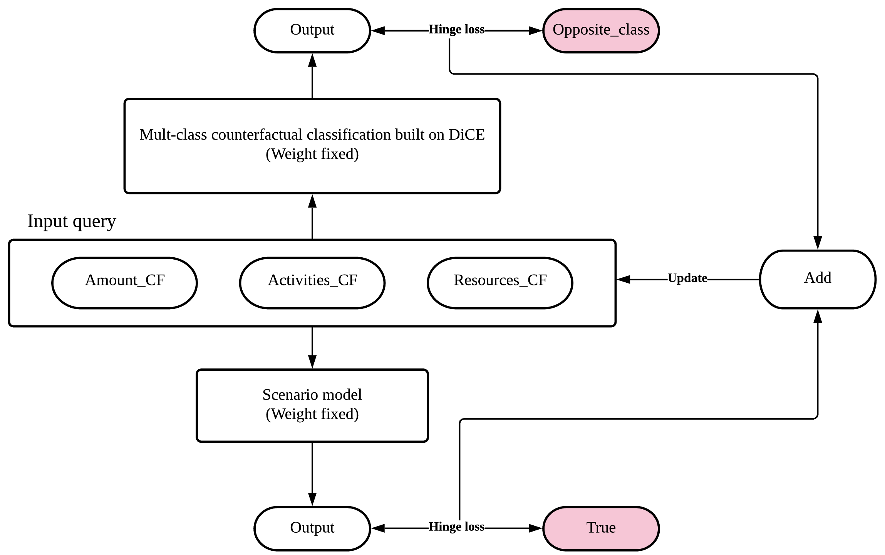

# Datasets

## BPI2012

### Activities


___
### Paths


___
# To generate counterfactual

## Method 1: DiCE

[[Documentation](http://interpret.ml/DiCE/index.html)]
[[GitHub](https://github.com/interpretml/DiCE)]
[[Paper](https://arxiv.org/abs/1905.07697)]

#### Model to use
Instead of using the LSTM baseline model directly, we have to implementation some modifications to run on **DiCE**.


### Example:

1. Assume we have input trace like this.

```python
['<SOS>', 'A_SUBMITTED_COMPLETE', 'A_PARTLYSUBMITTED_COMPLETE',
'A_PREACCEPTED_COMPLETE', 'A_ACCEPTED_COMPLETE',
'O_SELECTED_COMPLETE', 'A_FINALIZED_COMPLETE', 'O_CREATED_COMPLETE',
'O_SENT_COMPLETE','W_Completeren aanvraag_COMPLETE',
'W_Nabellen offertes_COMPLETE']
```

2. If we throw it into the LSTM baseline model, we can get the result (Probability distribution of next activity):


from above we can know the model think `"W_Nabellen offertes_COMPLETE"` has highest probability (0.640346) to be next activity.

3. Then, we feed the same trace to DiCE for generating couterfactuals. 

DiCE return a counterfactual like this:


Or the full counterfataul trace like this:

```python
['A_ACCEPTED_COMPLETE', 'A_PARTLYSUBMITTED_COMPLETE', 'A_PREACCEPTED_COMPLETE',
'A_ACCEPTED_COMPLETE', 'O_SELECTED_COMPLETE', 'A_FINALIZED_COMPLETE', 'O_CREATED_COMPLETE',
'O_SENT_COMPLETE', 'W_Completeren aanvraag_COMPLETE', 'O_DECLINED_COMPLETE']
```

**However, from above example, we can indentify some issues when using event log with DiCE.**

### Issues 1: from original DiCE.

- The counterfactual doesn't follow the constraints from BPI2012. Every case should start with `A_SUBMITTED_COMPLETE`. However, the counterfactaul replace it with `A_ACCEPTED_COMPLETE`, which occurs two times in this trace. 


- The fail trace is hard to find counterfactual. 
The average length for successful cases and failed cases are `27.94` and `10.53`, respectively. When we're trying to take a fail case with `length = 10` to find a successful case counterfactual, it will be hard since the LSTM will indetify most of the short trace to be declined or canceled and *our approach can't vary the length of trace*.


<br>
<br>
<br>
<br>
<br>
<br>


## Couterfactual with resource and amount

The previous experiments didn't come out with good results. Most of the counterfactauls we found don't make any sense in the domain of process mining. To solve this problem, we first attemp to include more information for the model to learn. Hence, we include the information of resources and amount of the loan.

___

### Model Architecture
When using bidirectional-LSTM, task of predicting next event will have problem during training. Therefore, I use normal LSTM.



### Running example (A_ACTIVATED_COMPLETE => A_DECLINED_COMPLETE) :

I retrieve a case from test set, it has activities, resources and amount like below:

#### Case info

```python

# Activities
['A_SUBMITTED_COMPLETE', 'A_PARTLYSUBMITTED_COMPLETE', 'A_PREACCEPTED_COMPLETE', 'W_Afhandelen leads_COMPLETE', 'W_Completeren aanvraag_COMPLETE',
'A_ACCEPTED_COMPLETE', 'A_FINALIZED_COMPLETE', 'O_SELECTED_COMPLETE', 'O_CREATED_COMPLETE', 'O_SENT_COMPLETE', 'W_Completeren aanvraag_COMPLETE',
'W_Nabellen offertes_COMPLETE', 'W_Nabellen offertes_COMPLETE', 'W_Nabellen offertes_COMPLETE', 'W_Nabellen offertes_COMPLETE',
'W_Nabellen offertes_COMPLETE', 'O_SENT_BACK_COMPLETE', 'W_Nabellen offertes_COMPLETE', 'W_Valideren aanvraag_COMPLETE', 'W_Valideren aanvraag_COMPLETE',
'W_Nabellen incomplete dossiers_COMPLETE', 'O_CANCELLED_COMPLETE', 'O_SELECTED_COMPLETE', 'O_CREATED_COMPLETE', 'O_SENT_COMPLETE',
'W_Nabellen incomplete dossiers_COMPLETE', 'W_Nabellen incomplete dossiers_COMPLETE', 'W_Nabellen incomplete dossiers_COMPLETE', 
'W_Nabellen incomplete dossiers_COMPLETE', 'O_SENT_BACK_COMPLETE', 'W_Nabellen incomplete dossiers_COMPLETE', 'O_ACCEPTED_COMPLETE',
'A_APPROVED_COMPLETE', 'A_REGISTERED_COMPLETE']

# Resource (Staff ID)
['112', '112', '11001', '11001', '11180',
'11201', '11201', '11201', '11201', '11201', '11201',
'11201', '11119', '11119', '10889', '11122', '11029',
'UNKNOWN', '10138', '10138', '10982', '11169', '11169',
'11169', '11169', '11169', '11169', '10913', '11049', 
'10789', '10789', '10138', '10138', '10138']

# Amount
5000

```


### Case prediction result:
```
Predicted activity with highest probability (1.00) is "A_ACTIVATED_COMPLETE"
```

It's not surprise that "A_REGISTERED_COMPLETE" usually followed by "A_ACTIVATED_COMPLETE".


---

### Generate counterfactual: 

To generate a counterfactual, we want the next activity to be 'A_DECLINED_COMPLETE' rather than current prediction, 'A_ACTIVATED_COMPLETE'. (desired_activity = 'A_DECLINED_COMPLETE')


#### Counterfactuals the algorithm found:

```python
# Activities 
['A_ACTIVATED_COMPLETE', 'A_ACTIVATED_COMPLETE', 'W_Beoordelen fraude_COMPLETE', 'W_Valideren aanvraag_COMPLETE', 'A_ACCEPTED_COMPLETE',
'O_DECLINED_COMPLETE', 'O_SELECTED_COMPLETE', 'O_SELECTED_COMPLETE', 'O_SENT_BACK_COMPLETE', 'W_Afhandelen leads_COMPLETE',
'A_PREACCEPTED_COMPLETE', 'W_Afhandelen leads_COMPLETE', 'A_REGISTERED_COMPLETE', 'O_CREATED_COMPLETE', 'O_SENT_BACK_COMPLETE',
'O_SENT_COMPLETE', 'O_SELECTED_COMPLETE', 'A_ACTIVATED_COMPLETE', 'A_ACCEPTED_COMPLETE', 'O_SENT_BACK_COMPLETE', 'O_SENT_BACK_COMPLETE',
'O_CREATED_COMPLETE', 'A_CANCELLED_COMPLETE', 'A_PARTLYSUBMITTED_COMPLETE', 'O_SENT_BACK_COMPLETE', 'A_REGISTERED_COMPLETE', 'O_ACCEPTED_COMPLETE',
'O_SELECTED_COMPLETE', 'W_Afhandelen leads_COMPLETE', 'O_ACCEPTED_COMPLETE', 'W_Afhandelen leads_COMPLETE', 'A_PARTLYSUBMITTED_COMPLETE',
'O_SENT_COMPLETE', 'O_SENT_BACK_COMPLETE']

# Resources
['10188', '11269', '10913', '10914', '11200', '11201', '10863',
'11119', '10809', '10859', '10125', '11120', '11254', '11254',
'10862', '10862', '10929', '11259', '11111', '10125', '11002',
'10899', '10912', '11169', '10861', '10910', 'UNKNOWN', '11119',
'10931', 'UNKNOWN', '10971', '10982', '11259', '10188']

# Amount
35

```
From above result, we can see we still has the issue mentioned in the [previous example](https://github.com/ChihchengHsieh/LINDA-BN-Eventlog-TF/blob/master/README.md#issues).

# Issue 1: Hard to train and get the counterfactual.
Since tensorflow using "argmax" in the embedding layer. This operation is not differentiable; therefore, the gradient can't propagate properly. To solve this issue, I get the weight (embedding matrix) from the embedding layer. And do matrix multiplication on it rather than 'argmax'. This apporach significantly improve the trainability of counterfactual.

------------------

<br>
<br>
<br>
<br>
<br>
<br>
<br>


# Introducing scenario loss.

Since the results from previous experiments are not valid BPI 2012 traces, we design to train a classifier and add its output to the loss function to constraint activities and resources to follow the rules of process mining. 

## How original DiCE get counterfactual (Briefly explain with chart)



## How to generate counterfactual with scenario (additional) loss.



### [ScenarioCf] Problem encounter : the indentifier recognise some weird trace as a valid trace

for exmaple, the scenario classifier think trace below is valid:

```python
 ['<SOS>', 'A_SUBMITTED_COMPLETE', 'A_PARTLYSUBMITTED_COMPLETE',
 'A_PREACCEPTED_COMPLETE', 'W_Afhandelen leads_COMPLETE',
 'W_Completeren aanvraag_COMPLETE', 'A_ACCEPTED_COMPLETE',
 'O_SELECTED_COMPLETE', 'A_FINALIZED_COMPLETE', 'O_CREATED_COMPLETE',
 'O_SENT_COMPLETE', 'W_Completeren aanvraag_COMPLETE', 'O_SELECTED_COMPLETE',
 'O_CANCELLED_COMPLETE', 'O_CREATED_COMPLETE', 'O_SENT_COMPLETE',
 'W_Nabellen offertes_COMPLETE', 'O_CANCELLED_COMPLETE', 'O_SELECTED_COMPLETE',
 'O_CREATED_COMPLETE', 'O_SENT_COMPLETE', 'W_Nabellen offertes_COMPLETE', 'W_Nabellen offertes_COMPLETE',
 'A_PREACCEPTED_COMPLETE', 'A_PREACCEPTED_COMPLETE', 
 'A_PREACCEPTED_COMPLETE', 'A_PREACCEPTED_COMPLETE',
 'A_PREACCEPTED_COMPLETE','A_PREACCEPTED_COMPLETE', 'A_PREACCEPTED_COMPLETE',
 'W_Nabellen incomplete dossiers_COMPLETE', 'W_Nabellen incomplete dossiers_COMPLETE',
 'W_Nabellen incomplete dossiers_COMPLETE', 'W_Nabellen incomplete dossiers_COMPLETE'
 ]
```
The above example has "A_PREACCEPTED_COMPLETE" to show up multiple times. However, the scenario model is not robust enough to classify it correctly. To solve this issue, we may need to come out another idea of generating artificial traininig data to allow the model to distinguish more kinds of invalid trace. Or, we can simply increase the size of the training dataset.

# Issue 2:  Why counterfactal is hard to find for categorical features. 


# What can be the bottleneck for counterfactual?

[One-Pixel Attack](https://arxiv.org/pdf/1710.08864.pdf)

[Fooling Deep Learning](https://www.nature.com/articles/d41586-019-03013-5)

When we're trying to generate a counterfactual for a model, if the model is not rubust enough, we're actually trying to find an input that can fool the prediction model. If the model itself can be easily fooled, the counterfactual we generate will tend to be unrealistic. If the image can just misguid the classifier by only muting one pixel, the prediction of process mining may also have the same problem.


### Our Algorithms


